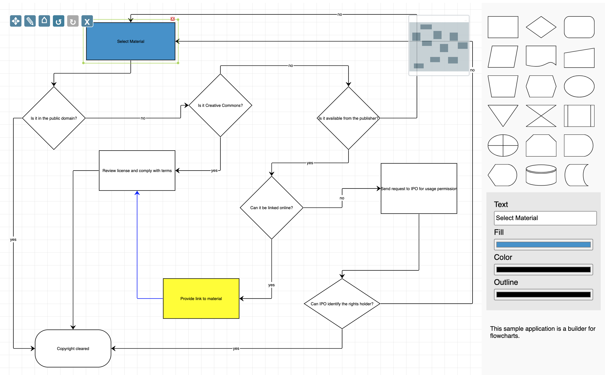
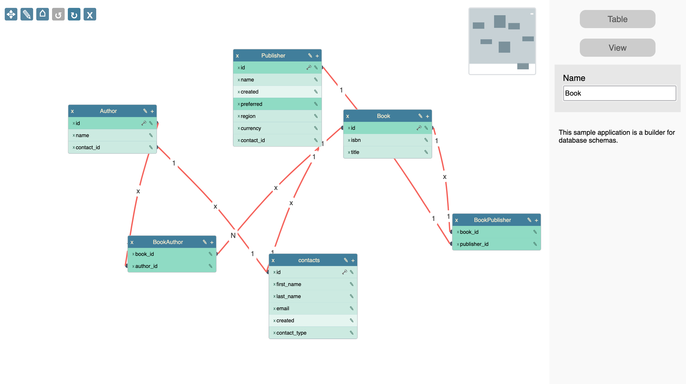

# jsplumbtoolkit-applications

Starter applications built with the jsPlumb Toolkit.

## Requirements

You'll need to be a licensee or evaluator of the [jsPlumb Toolkit](https://jsplumbtoolkit.com) to use the applications in this repository, and you will need to have access to at least version 6.2.4 of the Toolkit.

If you are not a licensee or an evaluator, you can request an evaluation of the Toolkit [on our site](https://jsplumbtoolkit.com/trial).

Both licensees and evaluators will need to first login to our NPM repository, instructions for which can be found [here](https://docs.jsplumbtoolkit.com/toolkit/6.x/lib/npm-repository).

## Installation

`package.json` contains targets for installing dependencies for each library integration separately, or all at once:

```bash
npm run install

npm run install:vanilla

npm run install:angular

npm run install:react

npm run install:vue2

npm run install:vue3

```

## Building

`package.json` contains targets for building some given version of the apps (of all the apps):

```bash

npm run build:vanilla
npm run build:angular
npm run build:react
npm run build:vue2
npm run build:vue3

```

but you can also build one individually:

```
cd apps/flowchart-builder/vanilla
npm run build
```


## Apps available

This repository currently contains two starter apps, with versions available for Vanilla JS, Angular, React, Vue 2 and Vue 3.

The Angular apps were created with Angular 16 as a dependency, but will run in previous versions of Angular down to Angular 12.  The React apps require React 17+ and were created with `create-react-app`. The Vue 2 and Vue 3 apps were created with `vite`.


### Flowchart Builder



You can test this app on our site at [https://jsplumbtoolkit.com/demonstrations/flowchart-builder](https://jsplumbtoolkit.com/demonstrations/flowchart-builder). 

Documentation can be found at [https://docs.jsplumbtoolkit.com/toolkit/6.x/lib/starter-app-flowchart-builder](https://docs.jsplumbtoolkit.com/toolkit/6.x/lib/starter-app-flowchart-builder).

### Schema Builder



NOTE: we are still working on the Angular, React, Vue 2 and Vue 3 versions of this app.

You can test this app on our site at [https://jsplumbtoolkit.com/demonstrations/schema-builder](https://jsplumbtoolkit.com/demonstrations/schema-builder).

Documentation can be found at [https://docs.jsplumbtoolkit.com/toolkit/6.x/lib/starter-app-schema-builder](https://docs.jsplumbtoolkit.com/toolkit/6.x/lib/starter-app-schema-builder).
